# 1. НАЗНАЧЕНИЕ ПРОГРАММЫ

Функциональным назначением программы является провидение и контроль занятий.

Конечными пользователями программы являются учителя, управляющие занятиями и оценками, ученики просматривающие занятия и оценки, администратор управляющий всеми данными.

# 2. УСЛОВИЯ ВЫПОЛНЕНИЯ ПРОГРАММЫ

В Таблице 1 представлены максимальные (или рекомендуемые) и минимальные технические средства для использования программы.

Таблица 1- Технические средства

| № | Тип оборудования | Наименование оборудования |
| --- | --- | --- |
| 1 | 2 | 3 |
| Стационарный компьютер |
| 1 | Размер экрана: | 22 [10] |
| 2 | Разрешение экрана: | 1680x1050 |
| 3 | Линейка процессора: | Intel Core 2 Duo 2.4 ГГц |
| 4 | Количество ядер процессора: | 2 |
| 5 | Оперативная память: | 8 ГБ |
| 6 | Тип видеокарты: | Дискретная |
| 7 | Видеокарта: | NVIDIA GeForce 510 |
| 8 | Конфигурация накопителей: | HDD |
| 9 | Общий объем всех накопителей: | 125 ГБ |
| 10 | Операционная система: | Windows 10 |
| Хранилище – это сервер хранилища исполняемого файла |
| 1 | Линейка процессора: | Intel Core 4 Duo 2.9 ГГц |
| 2 | Количество ядер процессора: | 4 |
| 3 | Оперативная память: | 10 ГБ |
| 4 | Конфигурация накопителей: | SSD + HDD |
| 5 | Общий объем всех накопителей: | 20 ГБ |
| 6 | Операционная система: | Ubuntu 18.04 |
| Сервер базы данных |
| 1 | Линейка процессора: | Intel Core 2 Duo 2.4 ГГц |
| 2 | Количество ядер процессора: | 4 |
| 3 | Оперативная память: | 2 ГБ |
| 4 | Конфигурация накопителей: | HDD |
| 5 | Общий объем всех накопителей: | 15 ГБ |
| 6 | Операционная система: | Ubuntu 18.04 |

В Таблице 2 представлены программные средства для использования программы.

Таблица 2- Программные средства

| № | Тип средства | Название средства | Назначение |
| --- | --- | --- | --- |
| 1 | 2 | 3 | 4 |
| 1 | Вспомогательное приложение | Discord | Обеспечение голосового чата |
| 2 | Операционная система | Microsoft Windows 10 | Организация взаимодействия программ и пользователя |

# 3. ВЫПОЛНЕНИЕ ПРОГРАММЫ

## 3.1. Действия для загрузки программы

Информационная система «Lesson» устанавливается с помощью инсталлятора «LessonInstall.exe» (Рисунок 1), который можно получить с помощью физического носителя.

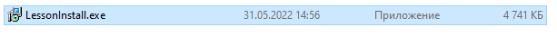

Рисунок 1- Setup

После скачивания запускаем инсталлятор (Рисунок 2). Нас приветствует мастер установки информационной системы «Контроль работы сотрудников»

В этом окне необходимо выбрать язык для работы установщика.

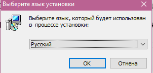

Рисунок 2 - Мастер установки

В следующем окне нам предоставляется возможность выбрать установочный путь (Рисунок 3). Также в этом окне указывается минимальный размер свободного пространства на диске.

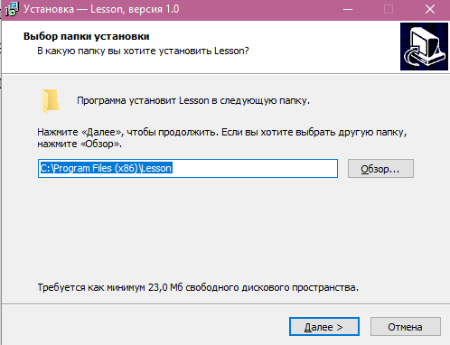

Рисунок 3 - Установочный путь

Далее мы можем выбрать дополнительные настройки, но в нашем случаи — это только создания ярлыка.

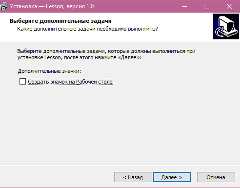

Рисунок 4 – Дополнительные настройки

На рисунке 5 общая информация об установке.

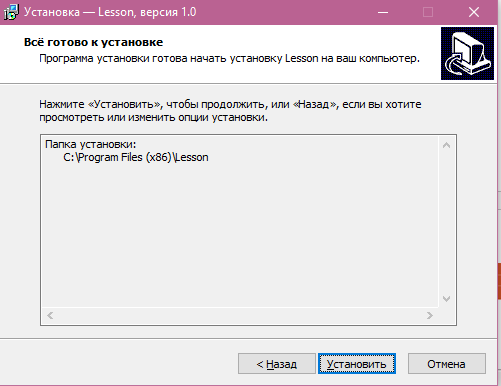

Рисунок 5 - Установка ярлыка на рабочем столе

Чтобы закрыть данное окно достаточно нажать «Завершить» (Рисунок 6). 
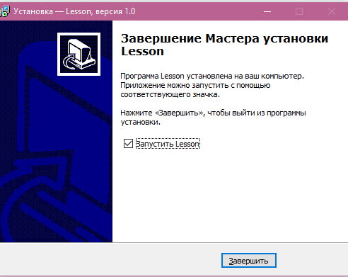

Рисунок 6 - Успешная установка

## 3.2 Выполнение программы с описанием функций

Для начала пройдём регистрацию, для этого после запуска приложения оказавшись в окне &quot;Авторизации&quot; нажмём кнопку &quot;перейти к регистрации&quot;. В открывшемся окне &quot;Регистрации&quot; в первом поле указываем своё ФИО, отчество может быть не указное если отсутствует, в следующем поле логин для авторизации, ещё ниже пароль и в конце из списка выбираем нужную для нас роль. Далее нажимаем на кнопку регистрация и оказываемся на окне выбранной роли.

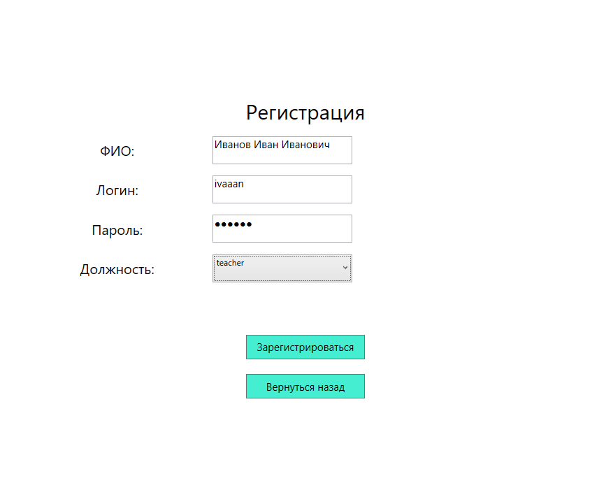

Рисунок 7 – Регистрация

Но так как на новый аккаунт не настроен на нём ничего не будет доступно. Необходимо дождаться настройки администратора.

Так же приложение сохраняет авторизацию поэтому для перехода на другой аккаунт необходимо в верхнем правом нажать на кнопку выход, чтобы разлогинится в приложении.

Выйдем из аккаунта и проведём авторизацию в роли администратора. Для этого нам нужен созданный аккаунт администратора и его логин с паролем, укажем их в соответствующих полях и нажмём кнопку &quot;Авторизация&quot;.

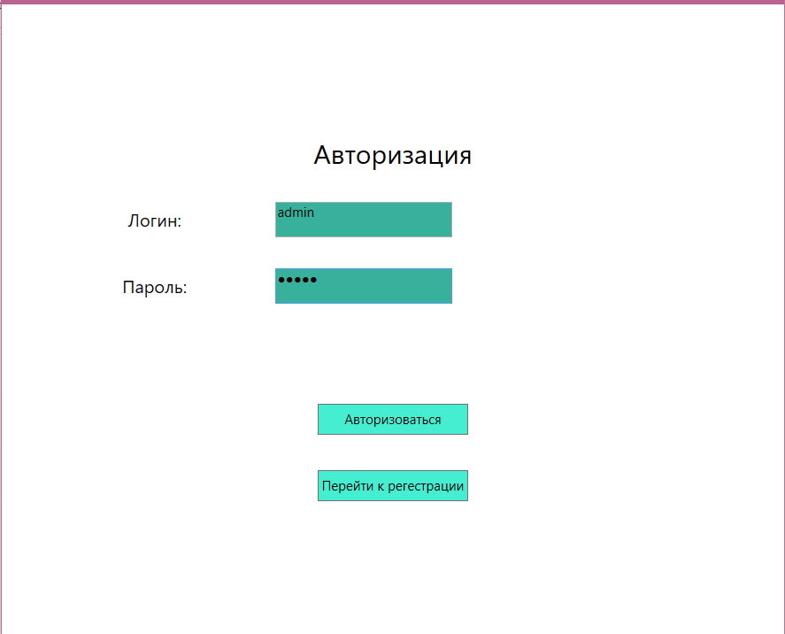

Рисунок 8 – Авторизация

В открывшемся окне администратора мы видим три таблицы &quot;Пользователи&quot;, &quot;Предметы&quot;, &quot;Группы&quot;. Последние две таблицы редактируются довольно просто, двойным нажатием на имеющейся запись для её редактирования и нажатием на нижние пусто поле для создание новой записи.

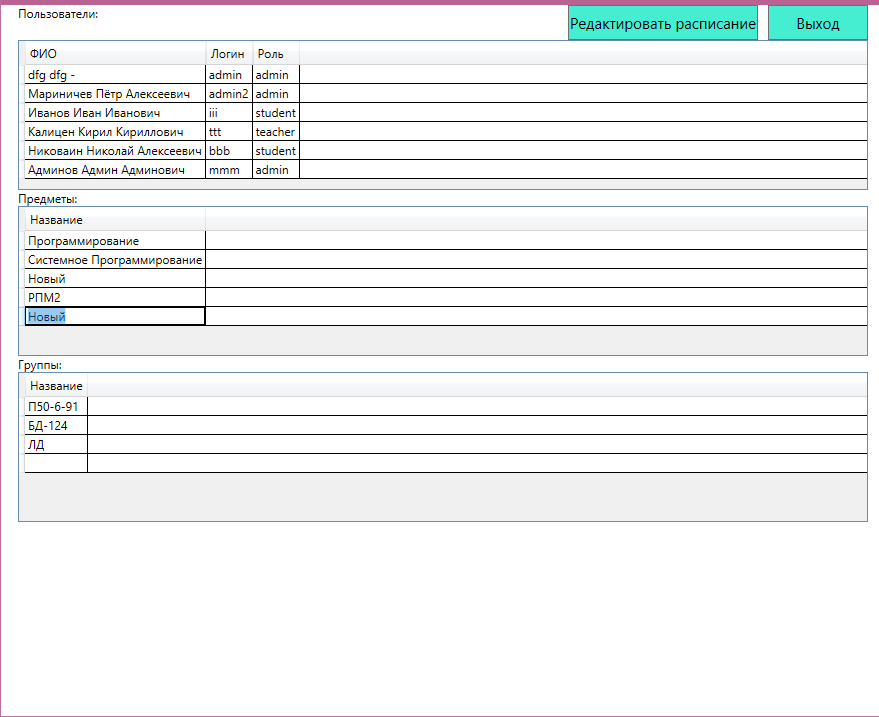

Рисунок 9 – Редактирование таблиц

Первая таблица с пользователями редактируются чуть иначе. Создавать пользователей нельзя, но можно редактировать и удалять. Для этого два раза нажмём ну нужную нам запись и откроется окно для редактирования. Тут указана вся информация о пользователе и её можно изменят. Так же именно здесь указывается к каким группа принадлежит пользователь. Пароль не отображается так как он проходит хеширование и не может быть восстановлен в прежний вид для безопасности, но можно указать новый пароль. Для удаления достаточно нажать кнопку &quot;Удалить&quot; в ином случаи нажать кнопку &quot;Сохранить&quot; и продолжить работу.

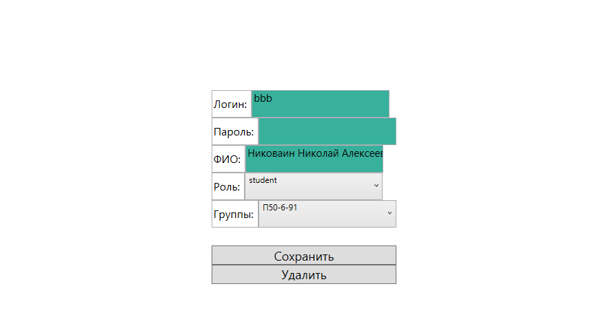

Рисунок 10 – Редактирование пользователя

Перейдём к редактированию расписания для администратора. Для этого из основного окна администратора нажмём на кнопку &quot;Редактировать расписание&quot;. В данном окне отображается таблица с столбцами номеров пар и строками групп. На пересечение группы и номера пары мы можем из выпадающего списка выбрать нужный предмет, который будет проходить в это время или же выбрать пустой элемент для удаления. Так же в выпадающем списке над таблицей можно выбрать номер дня недели. Для сохранений изменений необходимо нажать кнопку &quot;Сохранить&quot;.

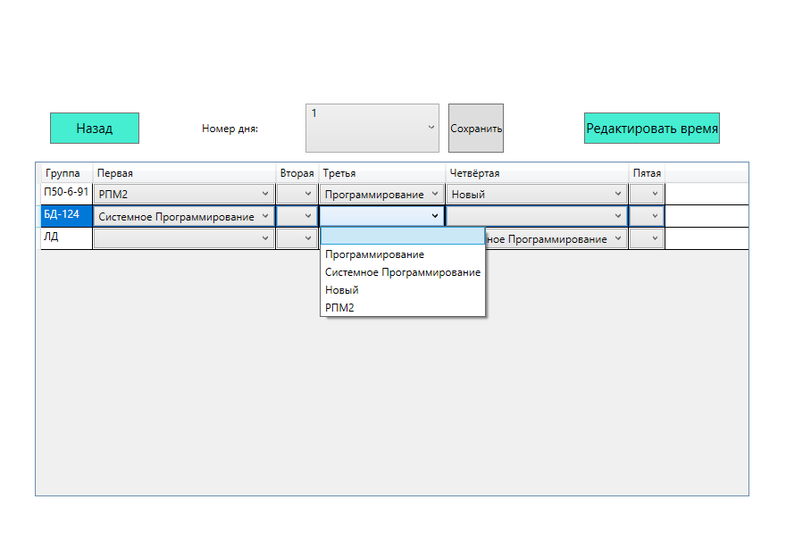

Рисунок 11 - Расписание

Для администратора так же присутствует возможность редактирования времени проведения занятий. Чтобы открыть окно редактирование необходимо в окне &quot;Редактирование расписания&quot; нажать на кнопку &quot;редактировать время&quot;. В открывшемся окне мы видим выпадающий список с номерами пар и два TimePicker отвечающие за время начала и конца занятия. Отредактировав время, мы можем нажать на кнопку &quot;Сохранить&quot; для фиксации изменений.

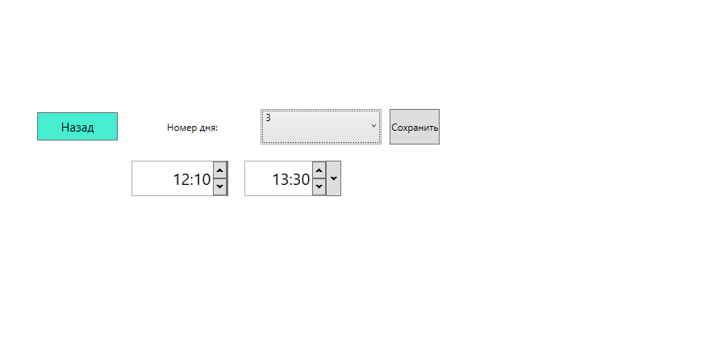

Рисунок 12 – Редактирования времени занятий

Выйдем из аккаунта для демонстрации возможностей учителя. Использовав логин и пароль пользователя с ролью &quot;Учитель&quot; и который прошёл настройку, авторизуемся.

В открывшемся окне мы видим таблицу с оценками, для управления ей в выпадающих списках выше мы можем выбирать интересующую группу и предмет, а в DatePicker нужную дату, для отображения оценок в выбранной настройки. Справа от студента есть выпадающий список с оценками, можем выбрать любую или выбрать пустое значение для удаления оценки. Нажимаем кнопку &quot;Сохранить&quot; для фиксации изменений.

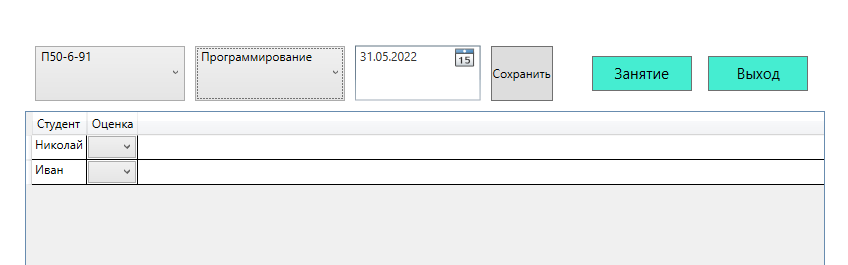

Рисунок 13 – редактирование оценок

Перейдём к проведению занятия с стороны учителя. Для этого в основном окне учителя нажмём кнопку &quot;Занятие&quot; и если в данный момент у выбранной группы из списка проходит занятие основываясь на их расписание и времени проведения занятий, то у нас покажется интерфейс для работы, в ином случаи сообщение о том, что занятие в данный момент не проходит.

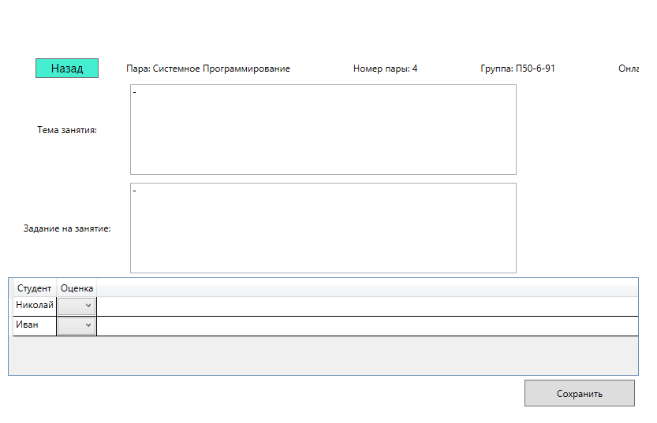

Рисунок 14 – Проведение занятия

Во время проведения занятия мы видим основную информацию о занятие название пары, номер пары, название группы и текущие количество участников занятия. Такую информацию как тема занятия и задание на занятие мы можем редактировать и это почти сразу отобразиться у всех учеников занятия. В самом низу находится таблица студентов аналогичная той что на главной в которой мы сразу можем указать оценку на занятие. Так же для фиксации нажмём кнопку &quot;Сохранить&quot;. В момент открытия окна занятия так же был создан голосовой чат для общения с учениками, информация о &quot;Онлайн&quot; динамическая и показывает количество людей в голосовом чате.

Выйдем из аккаунта для демонстрации возможностей студента. Использовав логин и пароль пользователя с ролью &quot;Студент&quot; и который прошёл настройку, авторизуемся. В главном окне студента мы видим таблицу с оценками за предметы в зависимости о выбранной даты в DatePicker над таблицей. Оценки доступны только для просмотра.

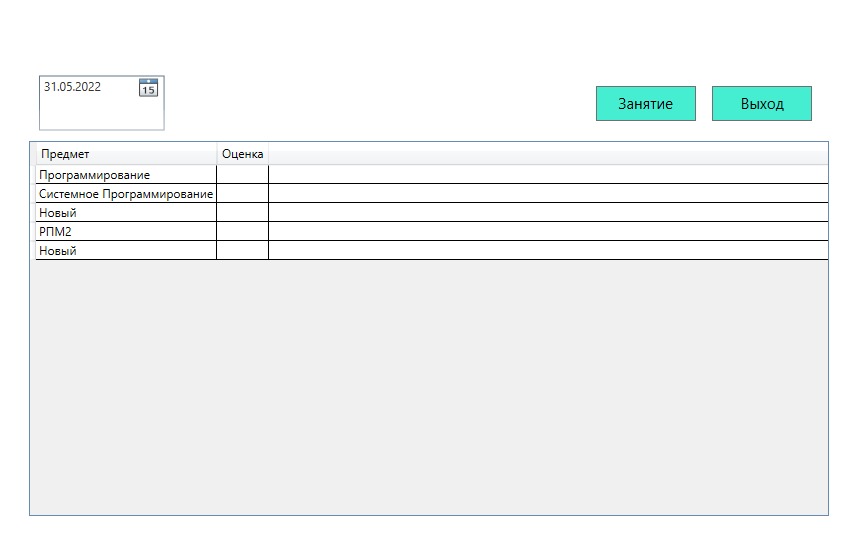

Рисунок 15 – Окно студента

Перейдём к проведению занятия с стороны студента. Для этого в основном окне студента нажмём кнопку &quot;Занятие&quot; и если в данный момент у наблюдаемой группы проходит занятие основываясь на их расписание и времени проведения занятий, то у нас покажется интерфейс для работы, в ином случаи сообщение о том, что занятие в данный момент не проходит. Во время проведения занятия мы видим основную информацию о занятие название пары, номер пары, текущие количество участников занятия, тема занятия, задание на занятие, оценка за пару. Тема занятие, задание на занятие, оценка за пару являются динамическими и обновляется с периодичным интервалом, так что при указании информации учителем, мы увидим изменения. В момент открытия окна занятия так же был создан голосовой чат для общения с учениками, информация о &quot;Онлайн&quot; динамическая и показывает количество людей в голосовом чате.

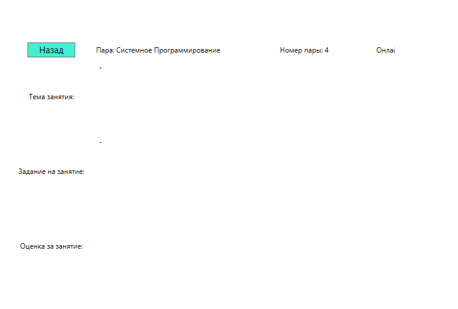

Рисунок 16 – Занятие студента

## 3.4. Действия для удаления программы

Провести деинсталляцию можно двумя способами:

Вбить в поиске Windows «Панель управления» и там же нажать на «Программы и компоненты» (Рисунок 17).

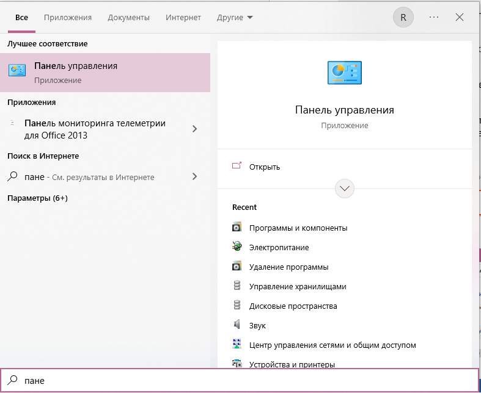

Рисунок 17 – Программы и компоненты

Перейдя в окно «Программы и компоненты» необходимо найти приложение Lesson и нажать на кнопку удалить (Рисунок 18).

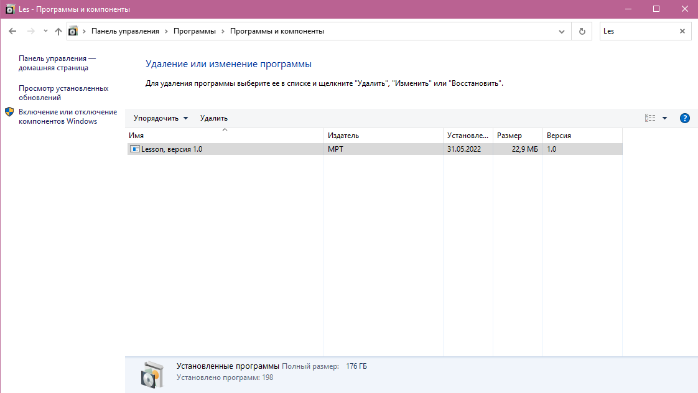

Рисунок 18 – Удаление

Появляется окно с информированием о готовности к удалению, нажимаем &quot;Да&quot; (Рисунок 19).

Рисунок 19 – Готовность удаления

После удаления всплывет окно, которое сообщит об успешном удалении программы с вашего устройства. Чтобы закрыть это окно, достаточно нажать на кнопку «Ок» (Рисунок 20).

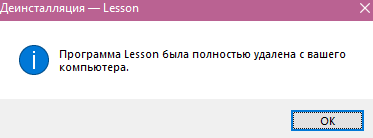

Рисунок 20 – Удаление завершено